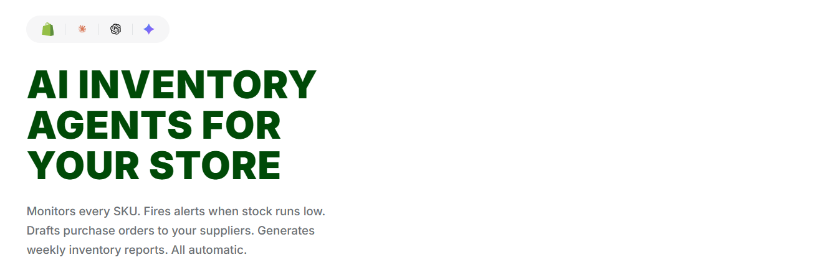

<p align="center">
  
</p>

# StockPilot

An embedded Shopify app that gives merchants real-time inventory intelligence — low-stock alerts, automated purchase order drafts, supplier management, and weekly inventory reports with AI-powered insights.


## Tech Stack

| Layer | Technology |
|-------|-----------|
| Backend | Ruby on Rails 7.2 |
| Database | PostgreSQL 16 |
| Background Jobs | Sidekiq 7 + Redis 7 |
| AI | Claude API (Anthropic SDK) |
| Auth | OmniAuth + Shopify OAuth (custom token exchange) |
| Multi-tenancy | acts_as_tenant (shop-scoped data isolation) |
| Security | Rack::Attack, Brakeman, bundler-audit, HMAC webhook verification |
| Monitoring | Sentry (Rails + Sidekiq) |
| CI | GitHub Actions (RuboCop, Brakeman, bundler-audit, RSpec + Postgres/Redis services) |

## Features

- **Inventory Sync** — Pulls product and variant data from Shopify's GraphQL Admin API, snapshots stock levels over time
- **Low-Stock Alerts** — Configurable per-variant thresholds with email notifications when stock drops below target
- **AI Purchase Orders** — Claude API generates draft purchase orders based on stock levels, lead times, and supplier history
- **Supplier Management** — Track suppliers, contacts, lead times, and star ratings; link suppliers to variants
- **Weekly Reports** — Timezone-aware scheduled reports with trend analysis delivered via email
- **GDPR Compliance** — Handles `customers/data_request`, `customers/redact`, and `shop/redact` webhooks with full data processing
- **Audit Logging** — Tracks all security-relevant events (auth, data exports, GDPR requests) with request metadata

## Architecture

```
Shopify Admin (App Bridge v4 session tokens)
        │
        ▼
┌─────────────────────────────────────────────┐
│  Rails 7.2 (embedded app)                   │
│                                             │
│  Auth ──── Inventory Sync ──── Alerts       │
│  OAuth     GraphQL + Webhooks  Email notifs │
│                                             │
│  AI Service ── Supplier Mgmt ── Reports     │
│  Claude API    CRUD + PO flow   Weekly jobs │
│                                             │
│  Security: Rack::Attack, HMAC, CSP, HSTS    │
│  Multi-tenancy: acts_as_tenant :shop        │
└──────────┬──────────────┬───────────────────┘
           │              │
     PostgreSQL 16    Sidekiq + Redis 7
```

## Security

- **Webhook HMAC-SHA256 verification** on all inbound Shopify webhooks
- **Rate limiting** via Rack::Attack — 60 req/min general, 5 req/min AI endpoints, 100 req/min webhooks
- **Encrypted access tokens** at rest using Rails 7.2 `encrypts`
- **Security headers** — HSTS, CSP (frame-ancestors restricted to Shopify), X-Content-Type-Options, Referrer-Policy
- **Static analysis** — Brakeman runs in CI; bundler-audit checks gems for CVEs
- **Tenant isolation** — All queries scoped via `acts_as_tenant`, no cross-merchant data leakage
- **CORS** restricted to app domain + `admin.shopify.com`

## Database

10 models with full validations, composite indexes, and cascade deletes:

`Shop` → `Product` → `Variant` → `InventorySnapshot`
&nbsp;&nbsp;&nbsp;&nbsp;&nbsp;&nbsp;&nbsp;&nbsp;&nbsp;&nbsp;&nbsp;&nbsp;&nbsp;&nbsp;&nbsp;&nbsp;&nbsp;&nbsp;&nbsp;&nbsp;&nbsp;&nbsp;&nbsp;&nbsp;&nbsp;&nbsp;&nbsp;&nbsp;&nbsp;&nbsp;&nbsp;&nbsp;&nbsp;&nbsp;&nbsp;&nbsp;&nbsp;&nbsp;&nbsp;&nbsp;&nbsp;&nbsp;&nbsp;&nbsp;→ `Alert`
`Shop` → `Supplier` → `PurchaseOrder` → `PurchaseOrderLineItem`
`Shop` → `AuditLog`

## Background Jobs

| Job | Purpose |
|-----|---------|
| `InventorySyncJob` | Fetches latest stock levels from Shopify GraphQL API |
| `DailySyncAllShopsJob` | Triggers sync across all installed shops |
| `AgentInventoryCheckJob` | AI-powered stock analysis and alert generation |
| `WeeklyReportJob` | Timezone-aware weekly inventory report emails |
| `SnapshotCleanupJob` | Prunes old inventory snapshots |
| `GdprCustomerDataJob` | Processes customer data export requests |
| `GdprCustomerRedactJob` | Redacts customer data on request |
| `GdprShopRedactJob` | Cleans up all shop data after uninstall |

## Tests

```
spec/
├── models/          # 9 model specs
├── requests/        # 12 request specs (auth, GDPR, rate limiting, security headers)
├── jobs/            # 9 job specs
├── services/        # Service layer specs (AI, inventory, notifications, Shopify client)
├── controllers/     # Controller specs
├── mailers/         # Alert, PO, and report mailer specs
├── security/        # Brakeman static analysis
├── concurrency/     # Race condition tests
├── resilience/      # Failure mode tests
└── integration/     # End-to-end flows
```

## Running Locally

Prerequisites: PostgreSQL 16 and Redis 7.

```bash
bundle install
bundle exec rails db:prepare
bundle exec rails server
bundle exec sidekiq -C config/sidekiq.yml   # separate terminal

# Tests
bundle exec rspec

# Lint + security
bundle exec rubocop
bundle exec brakeman
bundle exec bundler-audit check --update
```

## Environment Variables

See `.env.example` for the full list. Key variables:

- `SHOPIFY_API_KEY` / `SHOPIFY_API_SECRET`
- `ANTHROPIC_API_KEY`
- `DATABASE_URL`
- `REDIS_URL`
- `SENTRY_DSN`
